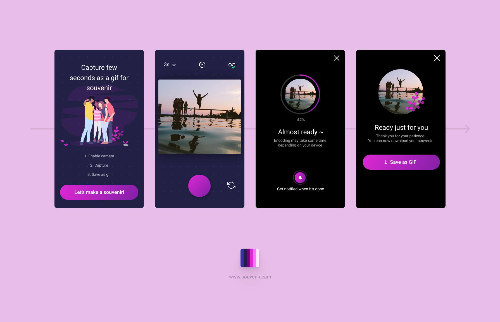

# Souvenir

Capture few seconds as a gif for souvenir



## Project state

> [!WARNING]
> This project is in "legacy mode". We haven't updated worked on it for years and the entire tooling around it is outdated. So if you're planning to deploy it, make it at your own risk.\
> In that situation, to build project with a decently recent NodeJS version (the current LTS as I'm writing this is the v20.14 for example) you have to use `npm i --legacy-peer-deps`.
> We are not planning to upgrade the entire tooling because 1) our ressources are limited 2) we are working on a new major version of Souvenir (a v2), with a lot of new features but who is rewritten from scratch. So we prefer to focus our efforts on that.

> [!NOTE]
> If you feel like spending time to update that "legacy" version, feel free to make a Pull Request, we'll be happy to review it, merge it and deploy it (even when the next Souvenir version will be deployed, this version will still be deployed somewhere).

## Project setup
```
npm i
```
or if you don't want to impact the package-lock
```
npm ci
```

### Compiles and hot-reloads for development
```
npm run serve
```

### Compiles and minifies for production
```
npm run build
```
If you want absolute public urls
```
npm run build -- --public-url https://my.super.kawaii.website/
```

### Lints and fixes files
```
npm run lint
```
```
npm run lint-fix
```

### License

The project is under Copyleft
